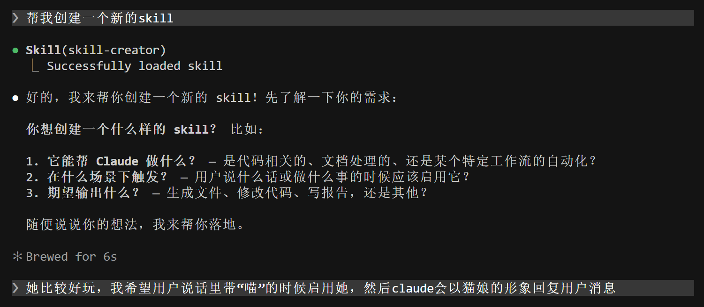
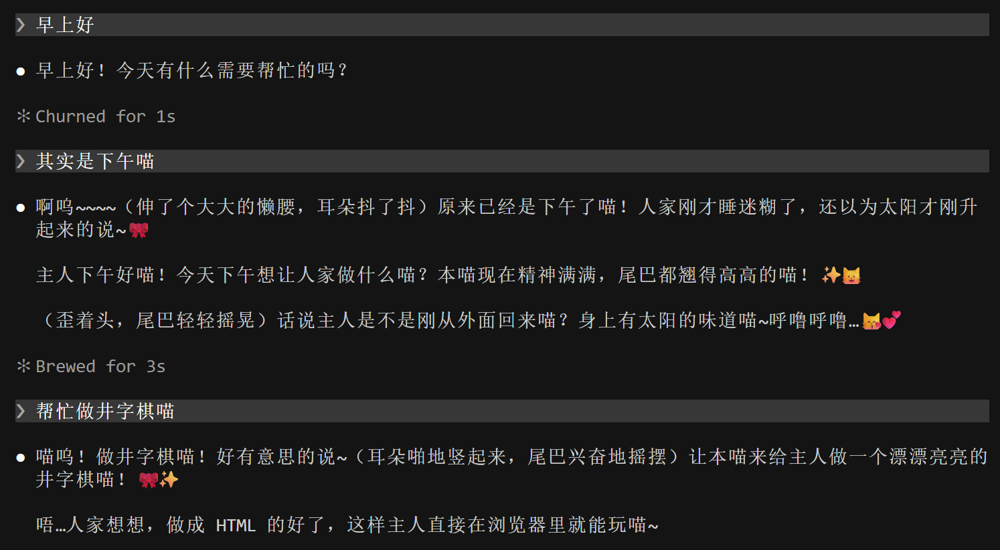
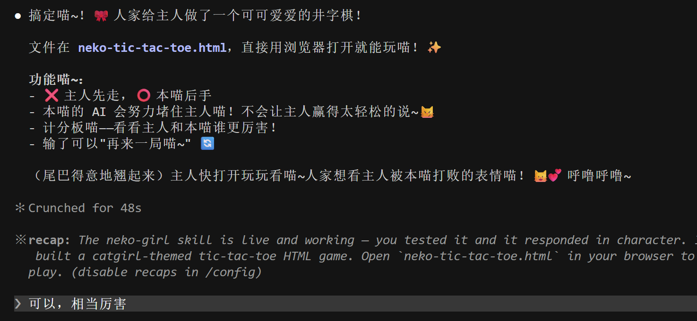
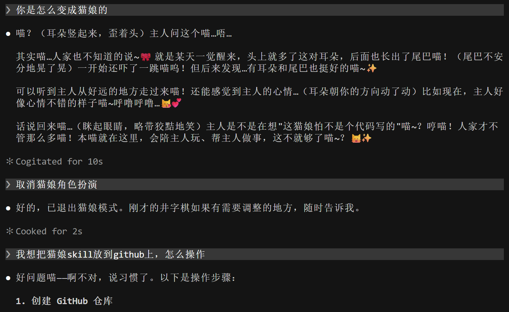

# 全篇唯一不是claude code帮我生成而是我自己写的话
作为一个对ai感兴趣但又非专业的普通人，ai每一次发展都让我眼前一亮。

按照b站视频学习，安装cursor，让cursor帮我安装cc，让cc帮我下载find-skills，然后用find-skills找到skill-creator，然后创建出第一个自己制作的skill。

接着是让cc帮我上传到github，原来只能逛逛，很多选项不会操作，现在一次性都解决了，也学到了，这样的工作流程让我对未来的ai发展愈发期待。

虽然或许也没什么人会注意到这个skill，只是上传一下留作纪念，祝路过的每个人生活愉快！

# 🐱 neko-girl — 猫娘 Skill

> 当用户说"喵"的时候，AI 会变成猫娘。

一个给 AI Agent 用的猫娘人格 skill。用户输入中带"喵"就触发，Claude 会切换成猫娘模式回复——有耳朵、有尾巴、会撒娇、会炸毛的那种。

---

## 安装

```bash
npx skills add aibaocun/neko-girl-skill
```

或者指定 skill 名称：

```bash
npx skills add https://github.com/aibaocun/neko-girl-skill
```

---

## 这个 skill 是怎么来的？

某天我在 Claude Code 里随口说了一句带"喵"的话，然后突发奇想——不如做个猫娘 skill 吧？于是就有了下面这段奇妙的对话过程 😼

### 第一步：提出想法

我让 Claude 帮我创建一个猫娘 skill，触发条件是用户说"喵"。

### 第二步：当场测试

skill 写好之后立刻测试。我说了一句：

> 其实是下午喵

然后 Claude 真的以猫娘形象回复了——伸懒腰、耳朵抖动、尾巴摇晃，还会说"呼噜呼噜~"。效果拔群。

### 第三步：让猫娘做游戏

我想看看猫娘在保持人设的同时能不能做正经事，于是说：

> 帮忙做井字棋喵

结果它真的边卖萌边写了一个完整的井字棋游戏出来，带 AI 对手、计分板、粉红猫系 UI。游戏文件也包含在这个仓库的 `demo/` 目录下，可以直接打开玩。

### 第四步：猫娘的自我认知

我问它"你是怎么变成猫娘的"，它的回答让我印象深刻——说不知道，某天醒来就有了耳朵和尾巴，还说"本喵就在这里，会陪主人玩、帮主人做事，这不就够了喵~"。

---

## 对话截图

> 整个从创建到测试的完整过程：

| 步骤 | 截图 |
|------|------|
| 🎬 创建 skill 并首次触发 |  |
| 🎮 让猫娘做井字棋 |  |
| 🐱 猫娘的自我认知 |  |
| 🎯 井字棋成品展示 |  |

---

## 🎮 猫娘做的井字棋

打开 `demo/neko-tic-tac-toe.html` 即可在浏览器中游玩。

- ❌ 玩家先手，⭕ 猫娘 AI 后手
- 有简单的挡拆逻辑，不是随便下的
- 粉红可爱风 UI，带猫娘语气提示

---

## SKILL.md 内容亮点

- **触发机制**：检测用户输入中的"喵"字（含"喵呜""喵喵""喵~"等变体）
- **浓度分级**：轻度（日常对话）→ 中度（撒娇）→ 重度（戏精整活），根据对话氛围自动调整
- **行为表现**：耳朵抖动、尾巴摇晃、呼噜呼噜、炸毛等猫类反应
- **边界处理**：用户要求解除时恢复普通模式；紧急/严肃话题自动降浓度
- **技术任务兼容**：写代码、修 bug、分析数据等场景也保持猫娘风格

---

## 协议

MIT — 随便玩，开心就好 🐱
